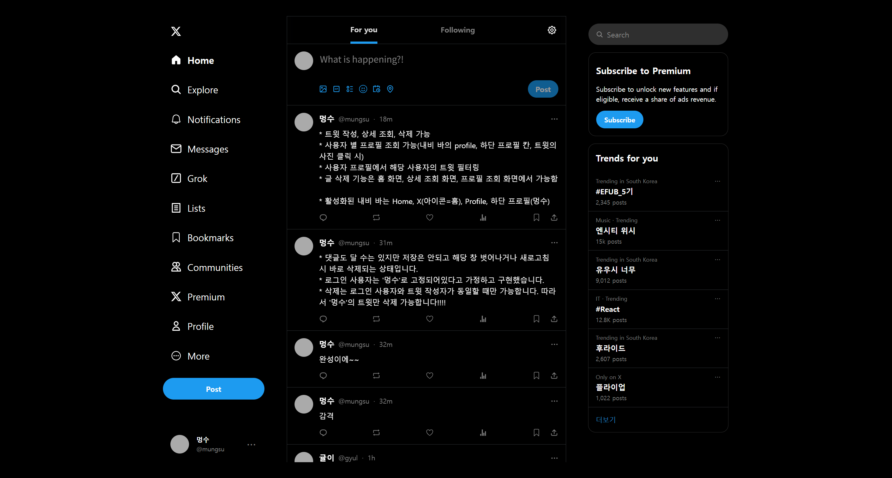
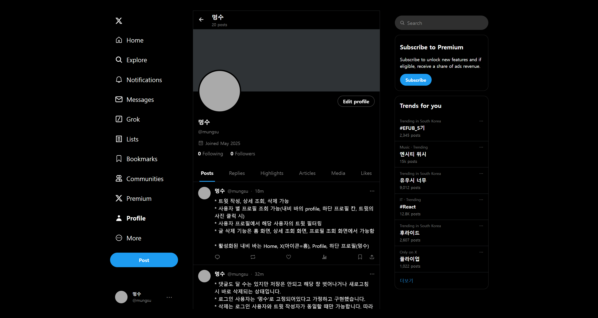

# 배포 URL (25.06.02.)

https://twitter-clone-tawny-phi.vercel.app/

  

# 기능 설명

- 내비게이션 바: X(아이콘: 홈), Home, Profile, 하단 유저 정보 칸이 활성화되어있습니다.
- 사용자가 '멍수'(@mungsu) 로 로그인되어있다고 고정된 상태입니다.

- 트윗 작성, 상세 조회, 삭제, 프로필 조회가 가능합니다.
  - 트윗 작성: 현재 로그인 된 사용자로 트윗이 작성됩니다. 작성 시간은 실시간으로 표시됩니다.
  - 트윗 상세 조회: 홈에서 트윗 컴포넌트를 누르면 상세 조회 화면으로 이동
    - 댓글 기능: 로그인된 사용자로 댓글을 작성할 수 있지만, 서버와 연결되지 않아서 저장은 되지 않습니다. 작성된 댓글은 페이지에 머물때만 유지됩니다.
  - 트윗 삭제: 홈화면, 상세 조회 화면, 프로필 조회 화면 모두 트윗 삭제가 가능합니다. 삭제는 오른쪽 점 3개(⋯) 를 누르면 가능합니다. 로그인 사용자와 트윗 작성자가 일치할 때만 클릭시 삭제 옵션이 뜹니다. (현재 '멍수'만 가능)
  - 프로필 조회: 사용자가 작성한 트윗 목록과 프로필 정보, 작성한 트윗 수가 표시됩니다.
    - 로그인 사용자 조회(내비 바): '멍수'의 프로필로 이동
    - 트윗 별 프로필 이미지 클릭: 해당 트윗 작성자의 프로필로 이동
